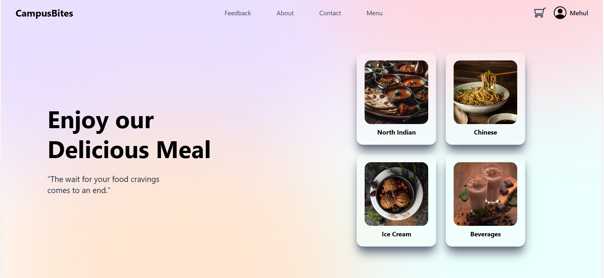
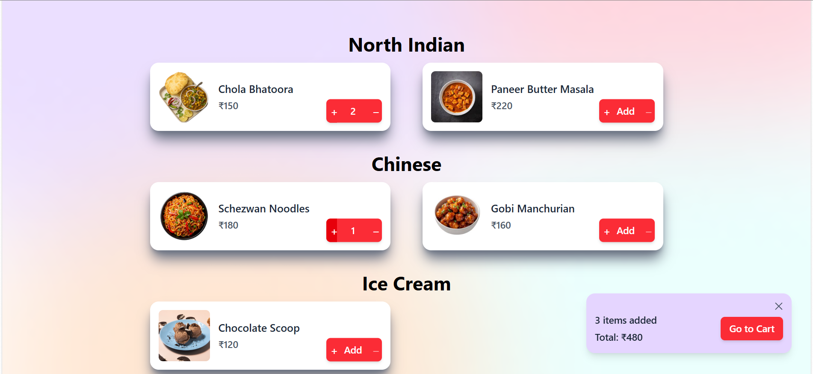
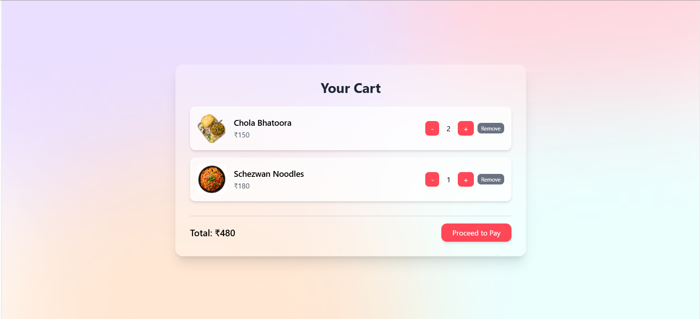
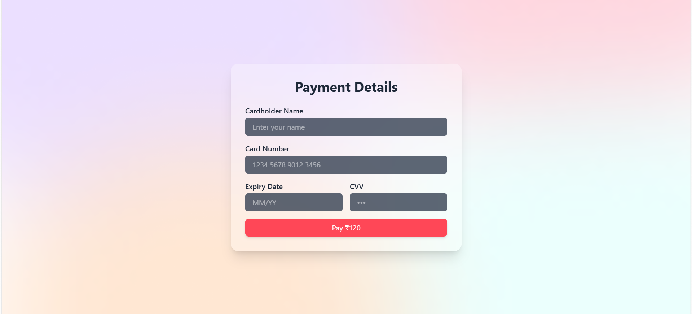
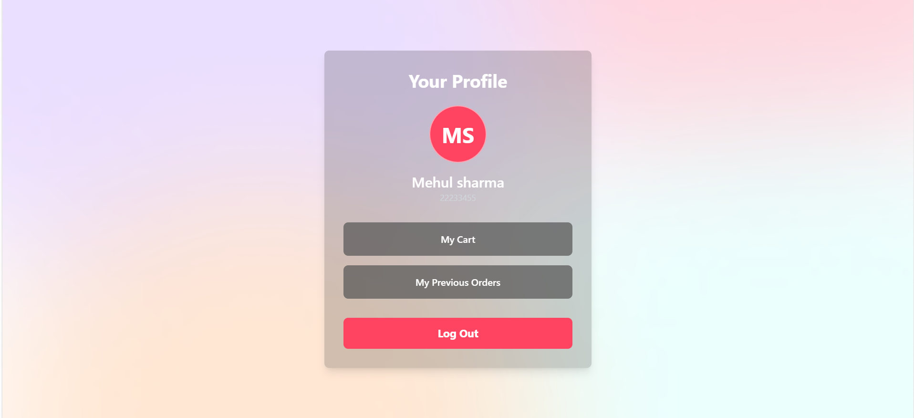
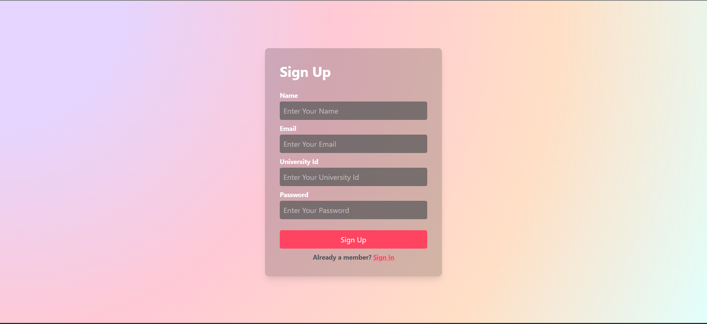
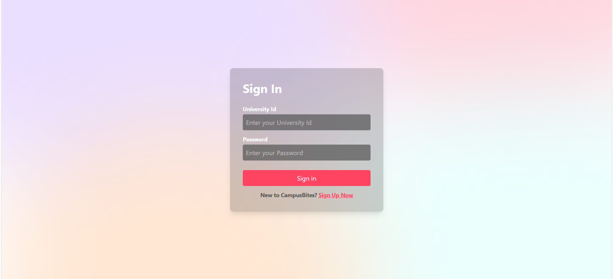

# Campus Bites

A modern, full-stack food ordering web application designed for campus environments with secure authentication, dynamic menu, and persistent shopping cart.

## 📸 Screenshots

### Home Page

*The main landing page displaying all restaurant menu items grouped by category.*

### Menu & Adding to Cart

*Shows the user browsing the menu and adding items to their cart.*

### Shopping Cart

*The user's cart, showing all added items, quantities, and the total price.*

### Payment Page

*The secure payment portal for completing the order (Protected Route).*

### User Profile

*Displays the logged-in user's information, like name and university ID.*

### Sign Up Page

*New user registration form with real-time validation.*

### Sign In Page

*Secure login page for existing users.*

## ✨ Features

- **Full-Stack Architecture:** Decoupled frontend and backend for scalability
- **User Authentication:** Secure sign-up & sign-in with JWT
- **Password Security:** Passwords hashed with bcrypt
- **Dynamic Menu:** Categorized menu items fetched from backend
- **Persistent Cart:** User carts stored in database
- **Protected Routes:** Cart, Profile, and Payment routes require authentication
- **API Validation:** Robust schema validation with zod
- **Database Seeding:** Pre-populated menu items script

## 🛠️ Tech Stack

**Backend:** Express.js, TypeScript, PostgreSQL, Prisma, JWT, bcrypt, zod

**Frontend:** React 19, Vite, TypeScript, Tailwind CSS, React Router, Axios, React Context

## 📂 Project Structure

```
campus-bites/
├── backend/
│   ├── prisma/
│   │   ├── migrations/
│   │   └── schema.prisma
│   ├── src/
│   │   ├── lib/prisma.ts
│   │   ├── middleware/auth.ts
│   │   ├── routes/
│   │   │   ├── auth.routes.ts
│   │   │   └── content.routes.ts
│   │   ├── index.ts
│   │   └── seed.ts
│   ├── .env.example
│   └── package.json
│
└── frontend/
    ├── public/images/foods/
    ├── src/
    │   ├── api/
    │   ├── components/
    │   │   ├── ui/
    │   │   └── ProtectedRoute.tsx
    │   ├── context/
    │   │   ├── AuthContext.tsx
    │   │   └── CartContext.tsx
    │   ├── hooks/
    │   ├── pages/
    │   ├── types/
    │   ├── App.tsx
    │   └── main.tsx
    └── package.json
```

## 📊 Database Models

- **User:** name, email, universityId, password (hashed)
- **MenuItem:** title, price, image, category
- **Cart:** One-to-one relationship with User
- **CartItem:** Links Cart to MenuItem with quantity
- **Order:** Records completed orders with total & status
- **OrderItem:** Details of items within an Order

## 🚀 Getting Started

### Prerequisites
- Node.js v18+
- npm/yarn
- PostgreSQL instance

### Backend Setup

```bash
cd backend
npm install
```

Create `.env` file:
```
DATABASE_URL="postgresql://<user>:<password>@<host>:<port>/<database>"
JWT_SECRET_USER="your-user-secret-key"
JWT_SECRET_ADMIN="your-admin-secret-key"
PORT=8000
```

Run migrations & seed:
```bash
npx prisma migrate dev
npx prisma db seed
npm run dev
```

Backend runs on `http://localhost:8000`

### Frontend Setup

```bash
cd frontend
npm install
npm run dev
```

Frontend runs on `http://localhost:5173`

## 📡 API Endpoints

| Method | Endpoint | Description |
|--------|----------|-------------|
| POST | `/api/v1/auth/signup` | Register new user |
| POST | `/api/v1/auth/signin` | Login user |
| GET | `/api/v1/content` | Fetch all menu items |
| GET | `/api/v1/content/cart` | Get user's cart (protected) |
| GET | `/api/v1/content/payment` | Payment placeholder |

## 🔐 Authentication Flow

1. User signs up with name, email, universityId, password
2. Password hashed with bcrypt before database storage
3. JWT token generated and returned
4. Token stored in localStorage on frontend
5. Protected routes check token validity via auth middleware
6. Token attached to requests via `Authorization: Bearer <token>` header

## 🛒 Cart Management

- Carts linked to user accounts (one-to-one)
- Add/remove items, update quantities
- Cart state managed via React Context
- Persistent across sessions via database

## 📸 Key Pages

- **Home:** Browse menu items by category
- **Sign In / Sign Up:** User authentication
- **Cart:** View and manage shopping cart
- **Profile:** View user info and logout
- **Payment:** Payment processing (placeholder)